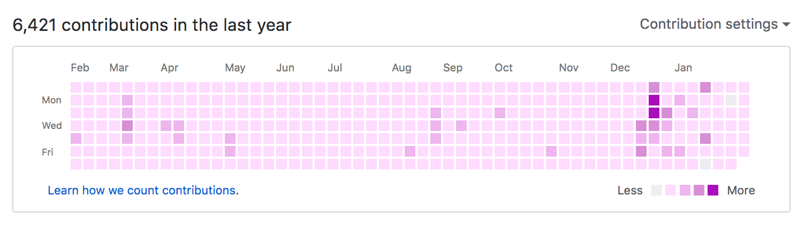

# spring-github
Browser extension for rendering spring color version of your GitHub contribution graph.

## installation

### Firefox

Only [Firefox Developer Edition](https://www.mozilla.org/ja/firefox/developer/) is supported at the moment. Set `xpinstall.signatures.required` to `false` in `about:config`. Download the `firefox/spring-github.xpi` file and open it in Firefox Developer Edition. Or, in Add-ons Manager, choose "Install Add-on From File" under the wrench icon and choose the xpi file you downloaded.